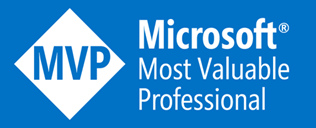
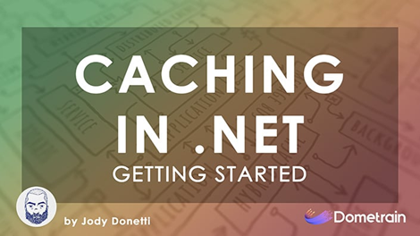
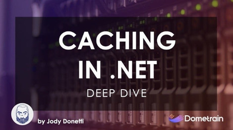
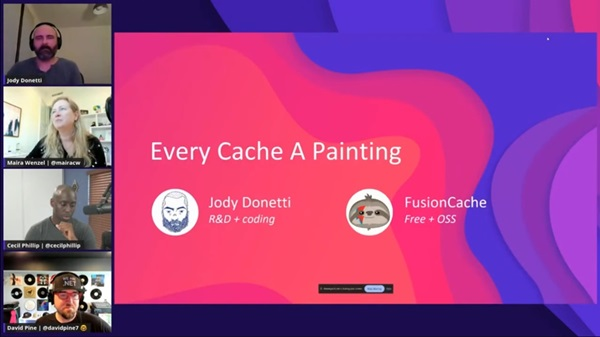

# Hi 🤌

### 💻 Principal Engineer + R&D

30 years designing, developing and evolving software.

### 🦥 FusionCache

I created [FusionCache](https://github.com/ZiggyCreatures/FusionCache): an easy to use, fast and robust hybrid cache with advanced resiliency features.

FusionCache is free and OSS, has been battle tested on real-world production apps and services for years like [HIBP (Have I Been Pwned)](https://x.com/stebets/status/1881361994340839832) and is used even [by Microsoft](https://devblogs.microsoft.com/azure-sql/data-api-builder-ga/) itself.

With the release of [v2](https://github.com/ZiggyCreatures/FusionCache/releases/tag/v2.0.0), FusionCache has become the first production-ready implementation of [Microsoft HybridCache](https://learn.microsoft.com/en-us/aspnet/core/performance/caching/hybrid?view=aspnetcore-9.0): not just the first 3rd party implementation but the [very first](https://x.com/jodydonetti/status/1881135481645339003) at all, including Microsoft's one.

### 🏆 Awards

I've been lucky enough to receive a couple of recognitions, mostly for my work on FusionCache, and for which I'm very thankful:
- [Google OSS Award](https://opensource.googleblog.com/2021/09/announcing-latest-open-source-peer-bonus-winners.html)
- [Microsoft MVP Award](https://mvp.microsoft.com/en-US/MVP/profile/139895de-396f-ed11-81ab-000d3a5600fa)

  
  &nbsp;&nbsp;&nbsp;&nbsp;
  

 

### 🧑‍🏫 Courses

If you are interested in all things caching, I published 2 courses on Dometrain: Caching in .NET, [Getting Started](https://dometrain.com/course/getting-started-caching-in-dotnet/?ref=jody-donetti) & [Deep Dive](https://dometrain.com/course/deep-dive-caching-in-dotnet/?ref=jody-donetti).

&nbsp;&nbsp;

If you like the FusionCache docs, you may like it too.

But mind you, they are not just about FusionCache but about caching as a whole: we'll go from the very foundations to pretty advanced topics and scenarios. We'll cover performance, robustness, resiliency and we'll see different real-world problems and, most importantly, solutions for them.

I tried condensing 20+ years dealing with caching in one place, all in an approachable way.

One journey, two chapters, filled with everything you can ask for about caching.

### 📺 Talks

Sometimes people have this idea of inviting me to their shows.
 
Oooh poor souls, they don't know I can ramble for hours about all things caching.

[Here](https://github.com/jodydonetti/talks) is a dedicated repo for that.

### 🔗 Social

You can find me here:

- [GitHub](https://github.com/jodydonetti)
- [Bluesky](https://bsky.app/profile/jodydonetti.bsky.social)
- [Twitter](https://twitter.com/jodydonetti)
- [LinkedIn](https://www.linkedin.com/in/jody-donetti/)
- [Sessionize](https://sessionize.com/jody-donetti/)

<!--
**jodydonetti/jodydonetti** is a ✨ _special_ ✨ repository because its `README.md` (this file) appears on your GitHub profile.

Here are some ideas to get you started:

- 🔭 I’m currently working on ...
- 🌱 I’m currently learning ...
- 👯 I’m looking to collaborate on ...
- 🤔 I’m looking for help with ...
- 💬 Ask me about ...
- 📫 How to reach me: ...
- 😄 Pronouns: ...
- ⚡ Fun fact: ...
-->
